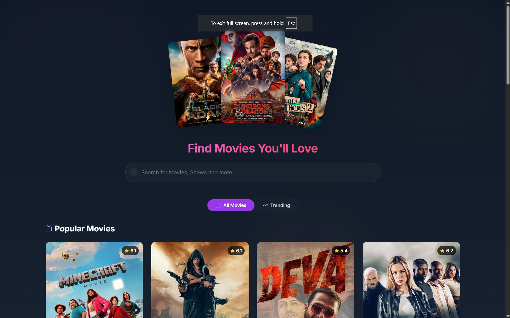
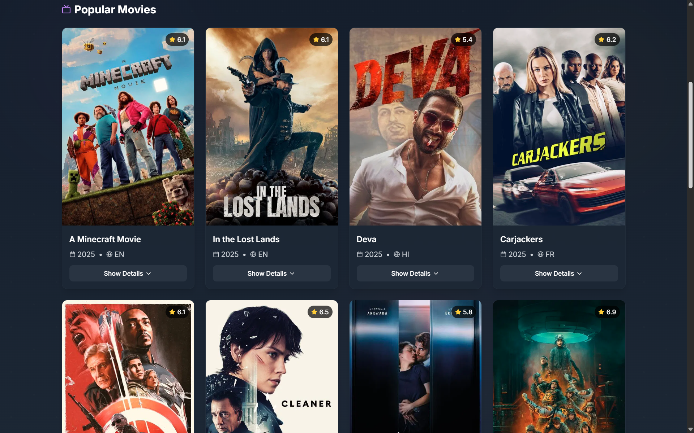

# MovieApp

MovieApp is a modern, responsive web application for browsing, discovering, and managing movie collections. With a sleek UI and smooth animations, it offers an engaging experience to explore movies, view details, and interact with personalized features like favorites and watchlists.

## Features

- **Browse Movies**: Discover trending, popular, or specific movies with an intuitive interface.
- **Movie Details**: View detailed information including synopsis, cast, ratings, and trailers.
- **User Authentication**: Secure login and registration.
- **Favorites/Watchlist**: Save movies to personalized lists (requires user account).
- **Responsive Design**: Optimized for desktop, tablet, and mobile devices.
- **Smooth Animations**: Enhanced UX with fluid transitions and effects.

## Tech Stack

-  Frontend
-  UI Components
-  Backend
-  Styling
-  Animations

## Screenshots

Here's a visual preview of MovieApp in action:

### Home Page

*Browse trending movies and discover new content*

### Movie Details

*Detailed view with cast information, ratings, and trailer*


## Prerequisites

Ensure you have the following installed:

- Node.js (v16 or higher)
- npm or yarn
- Appwrite instance (self-hosted or cloud)

## Installation

1. **Clone the repository**:
   ```bash
   git clone https://github.com/lande26/movieapp.git
   cd movieapp
   ```

2. **Install dependencies**:
   ```bash
   npm install
   ```
   or
   ```bash
   yarn install
   ```

3. **Set up Appwrite**:
   - Create an Appwrite project at [Appwrite Cloud](https://appwrite.io/) or your self-hosted instance.
   - Configure the following in a `.env` file:
     ```env
     VITE_APPWRITE_ENDPOINT=your-appwrite-endpoint
     VITE_APPWRITE_PROJECT_ID=your-project-id
     VITE_APPWRITE_API_KEY=your-api-key
     ```
   - Set up collections for movies, users, and favorites (refer to Appwrite docs).

4. **Configure environment variables**:
   - Create a `.env` file in the root directory.
   - Add any additional API keys (e.g., for movie data):
     ```env
     VITE_MOVIE_API_KEY=your-movie-api-key
     ```

5. **Run the app**:
   ```bash
   npm run dev
   ```
   or
   ```bash
   yarn dev
   ```
   The app will be available at `http://localhost:5173`.

## Usage

- **Home Page**: Browse featured movies and search for specific titles.
- **Movie Details**: Click a movie card to view its details.
- **User Features**: Sign up or log in to save movies to your favorites or watchlist.
- **Responsive Navigation**: Use the menu to explore different sections on any device.

## Project Structure

```
movieapp/
├── public/                # Static assets
├── src/
│   ├── assets/            # Images, icons, etc.
│   │   └── screenshots/   # Application screenshots
│   ├── components/        # Reusable components
│   ├── pages/             # Page components (Home, MovieDetails, etc.)
│   ├── services/          # API calls and backend integration
│   ├── styles/            # Custom styles
│   ├── App.jsx            # Main app component
│   ├── main.jsx           # Entry point
├── .env                   # Environment variables (not tracked)
├── package.json           # Dependencies and scripts
├── README.md              # This file
```

## Contributing

Contributions are welcome! To contribute:

1. Fork the repository.
2. Create a new branch (`git checkout -b feature/your-feature`).
3. Commit your changes (`git commit -m "Add your feature"`).
4. Push to the branch (`git push origin feature/your-feature`).
5. Open a Pull Request.

## Acknowledgements

- [Lucid React Library](https://lucid-react.dev/)
- [Appwrite](https://appwrite.io/)
- [Tailwind CSS](https://tailwindcss.com/)
- [Framer Motion](https://www.framer.com/motion/)
